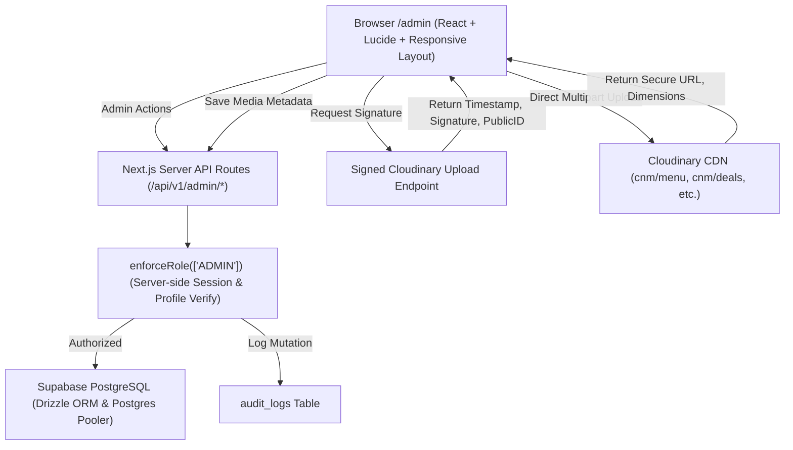

# Cluck N Moo (CNM) Admin Control Center Implementation Plan

**Target Route:** `/admin`  
**Security Boundary:** Verified `ADMIN` role only via server-side session checks  
**Date:** 2026-09-25  
**Version:** 1.0.0

---

## 1. Architectural Architecture & Strategy



---

## 2. Database Schema Migration Plan

We will execute safe, non-destructive SQL migrations:

1. **`products` Table Extensions:**
   ```sql
   ALTER TABLE products 
     ADD COLUMN IF NOT EXISTS is_archived BOOLEAN NOT NULL DEFAULT false,
     ADD COLUMN IF NOT EXISTS updated_at TIMESTAMPTZ NOT NULL DEFAULT NOW(),
     ADD COLUMN IF NOT EXISTS tags TEXT[] DEFAULT '{}';
   CREATE INDEX IF NOT EXISTS idx_products_archived ON products(is_archived);
   ```

2. **`categories` Table Extensions:**
   ```sql
   ALTER TABLE categories 
     ADD COLUMN IF NOT EXISTS is_archived BOOLEAN NOT NULL DEFAULT false,
     ADD COLUMN IF NOT EXISTS updated_at TIMESTAMPTZ NOT NULL DEFAULT NOW(),
     ADD COLUMN IF NOT EXISTS image_url TEXT;
   CREATE INDEX IF NOT EXISTS idx_categories_archived ON categories(is_archived);
   ```

3. **`audit_logs` Table:**
   ```sql
   CREATE TABLE IF NOT EXISTS audit_logs (
     id TEXT PRIMARY KEY,
     user_id UUID REFERENCES profiles(id) ON DELETE SET NULL,
     user_email TEXT,
     action TEXT NOT NULL,
     entity_type TEXT NOT NULL,
     entity_id TEXT,
     details JSONB,
     ip_address TEXT,
     created_at TIMESTAMPTZ NOT NULL DEFAULT NOW()
   );
   CREATE INDEX IF NOT EXISTS idx_audit_logs_action ON audit_logs(action);
   CREATE INDEX IF NOT EXISTS idx_audit_logs_entity ON audit_logs(entity_type, entity_id);
   CREATE INDEX IF NOT EXISTS idx_audit_logs_created ON audit_logs(created_at DESC);
   ```

4. **`media_assets` Table:**
   ```sql
   CREATE TABLE IF NOT EXISTS media_assets (
     id TEXT PRIMARY KEY,
     public_id TEXT NOT NULL UNIQUE,
     secure_url TEXT NOT NULL,
     folder TEXT NOT NULL DEFAULT 'cnm/menu',
     format TEXT,
     width INTEGER,
     height INTEGER,
     bytes INTEGER,
     alt_text TEXT,
     uploaded_by_user_id UUID REFERENCES profiles(id) ON DELETE SET NULL,
     created_at TIMESTAMPTZ NOT NULL DEFAULT NOW()
   );
   CREATE INDEX IF NOT EXISTS idx_media_assets_folder ON media_assets(folder);
   CREATE INDEX IF NOT EXISTS idx_media_assets_created ON media_assets(created_at DESC);
   ```

---

## 3. Server API Routes Specification

All endpoints are hosted under `/api/v1/admin/*` and protected with `enforceRole(["ADMIN"])`:

| Endpoint | Method | Purpose | Input / Payload |
| :--- | :--- | :--- | :--- |
| `/api/v1/admin/overview` | `GET` | Return aggregate stats: total products, total revenue, pending orders, sold-out counts, popular picks. | None |
| `/api/v1/admin/products` | `GET` | List all products with category, variants, modifiers count, image status, and tags. | Filter query parameters |
| `/api/v1/admin/products` | `POST` | Create new product with variants, modifier groups, and tags. | Product DTO |
| `/api/v1/admin/products/[id]` | `PUT` | Update product details, prices, variants, modifier mappings, and Cloudinary image. | Product DTO |
| `/api/v1/admin/products/[id]/availability` | `PATCH` | Quick-toggle `is_available` or `is_featured`. | `{ isAvailable?: boolean, isFeatured?: boolean }` |
| `/api/v1/admin/products/[id]/archive` | `PATCH` | Soft-archive product (safe for historical orders). | `{ isArchived: boolean }` |
| `/api/v1/admin/categories` | `GET` | List all categories with product count. | None |
| `/api/v1/admin/categories` | `POST` | Create new category. | `{ name, slug, displayOrder, isActive }` |
| `/api/v1/admin/categories/[id]` | `PUT` | Update category details and order. | Category DTO |
| `/api/v1/admin/categories/[id]` | `DELETE` | Safe archive/delete category if no active products. | None |
| `/api/v1/admin/deals` | `GET` | List all deal products and promotion bundles. | None |
| `/api/v1/admin/modifiers` | `GET` | List all modifier groups and options across items. | None |
| `/api/v1/admin/media` | `GET` | List media assets recorded in system with preview URLs. | None |
| `/api/v1/admin/media/sign` | `POST` | Generate secure signed upload parameters for Cloudinary direct upload. | `{ folder, customPublicId }` |
| `/api/v1/admin/media/save` | `POST` | Register uploaded Cloudinary asset in `media_assets`. | `{ publicId, secureUrl, width, height, format, bytes, altText }` |
| `/api/v1/admin/staff` | `GET` | List all staff members and active riders. | None |
| `/api/v1/admin/audit` | `GET` | Query recent audit activity logs. | `{ limit, page }` |

---

## 4. UI/UX Component Architecture

The single oversized `src/app/admin/page.tsx` is restructured cleanly with dedicated sub-components under `src/components/admin/`:

1. `AdminShell.tsx`: Responsive navigation shell with collapsible sidebar for desktop, mobile drawer, light/dark mode switcher, header, and user profile badge.
2. `AdminOverviewSection.tsx`: Summary KPI metric cards, quick-action shortcuts (Add Product, Check Live Orders, Manage Timings), and operational status banner.
3. `AdminProductsSection.tsx`:
   - Search bar (name, category, slug, tags).
   - Category filter pills.
   - Status filters (All, Available, Sold Out, Archived, Has Image, Missing Image).
   - Sort dropdown (Name, Price, Display Order, Date).
   - Card grid and responsive table toggle.
   - Quick actions: toggle sold out, edit, duplicate, archive.
4. `AdminProductModal.tsx`:
   - Tabbed editor:
     - Tab 1: Basic Info (Name, Slug auto-slugger, Category select, Base Price PKR, Short description, Ingredients).
     - Tab 2: Media (Current Cloudinary image, drag-and-drop uploader, replace, alt text).
     - Tab 3: Variants (Add/remove size variants e.g. Single/Double or Med/Large with price points).
     - Tab 4: Modifiers (Add/attach modifier groups, minimum/maximum selections, option rows with PKR adjustments).
     - Tab 5: Tags & Visibility (Popular, Spicy, New, Deal, Student Offer tags, display order, isFeatured toggle).
5. `AdminCategoriesSection.tsx`:
   - Category list with attached product counts.
   - Add Category modal.
   - Inline display order editor and active/inactive toggle.
6. `AdminDealsSection.tsx`:
   - Dedicated view for combo deals, box deals, and promotions.
   - Quick edit for deal pricing and active states.
7. `AdminMediaLibrarySection.tsx`:
   - Visual grid of uploaded food imagery.
   - Drag-and-drop Cloudinary direct uploader with compression/resizing preview.
   - Copy CDN URL, view metadata, and replace tool.
8. `AdminDeliverySection.tsx`:
   - Full management of delivery areas, fees, and active coverage.
9. `AdminSettingsSection.tsx`:
   - Restaurant phone, address, operating hours, day-of-week schedules, and store status override (Auto/Force Open/Force Closed).
10. `AdminStaffSection.tsx`:
    - Directory of kitchen staff and delivery riders with active statuses.
11. `AdminAuditSection.tsx`:
    - Chronological timeline of admin changes.

---

## 5. Rollback & Fault Tolerance Strategy

- **Zero Breaking Changes to Public Menu**:
  - The customer storefront continues reading from existing PostgreSQL columns. Public menu queries filter `is_archived = false` and `is_available = true`.
- **Database Non-Destructive Migrations**:
  - All new columns (`is_archived`, `tags`, `updated_at`) have defaults and do not require table locks or rewrites.
- **Order Pipeline Preservation**:
  - Cart calculation, order creation, order tracking, and receipt generation remain strictly unchanged.
- **Rollback Procedure**:
  - If a problem occurs during deployment, the previous `/admin/page.tsx` can be restored in seconds with `git revert`, with zero data loss to any table.
