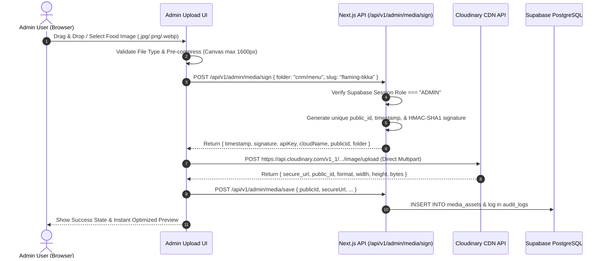

# Cluck N Moo (CNM) Cloudinary Admin Upload Security Plan

**Provider:** Cloudinary  
**Target Folders:** `cnm/menu`, `cnm/deals`, `cnm/promotions`, `cnm/media`  
**Date:** 2026-09-25  
**Version:** 1.0.0

---

## 1. Security Principles & Non-Negotiables

1. **Zero Secret Leakage in Browser Code:**
   - Under no circumstances shall `CLOUDINARY_API_SECRET` be exposed in client-side bundles, `window` globals, or public environment variables.
   - Only `NEXT_PUBLIC_CLOUDINARY_CLOUD_NAME` and `CLOUDINARY_API_KEY` (public identifier) are shared when uploading.

2. **Server-Side Authorization & Signature Generation:**
   - Upload permissions are gated behind Next.js server route `/api/v1/admin/media/sign`.
   - The route verifies that the requester holds the `ADMIN` role via Supabase session cookie validation.
   - The server computes the HMAC-SHA1 signature using Cloudinary's official algorithm:
     ```ts
     const stringToSign = Object.keys(params)
       .sort()
       .map(key => `${key}=${params[key]}`)
       .join('&') + apiSecret;
     const signature = crypto.createHash('sha1').update(stringToSign).digest('hex');
     ```

3. **Direct-to-Cloud Upload (Eliminates Server Bottlenecks):**
   - The browser sends the binary file directly to `https://api.cloudinary.com/v1_1/${cloudName}/image/upload`.
   - This bypasses Vercel/Node serverless payload limits (4.5 MB) and streams high-speed uploads directly to Cloudinary CDN.

4. **File Format & MIME-Type Validation:**
   - Accepted file types: `image/jpeg`, `image/png`, `image/webp`.
   - Client-side pre-validation + Cloudinary upload preset restriction.
   - Maximum upload size: 10 MB.

5. **Client-Side Image Optimization Prior to Upload:**
   - Before uploading, browser utilizes HTML5 `<canvas>` resizing to ensure the image does not exceed 1600px width/height while preserving aspect ratio.
   - Converts to high-quality WebP/JPEG format (0.90 quality) to save bandwidth without sacrificing food crispness or colors.

---

## 2. Upload Lifecycle Diagram



---

## 3. Asset Folder Structure

All media assets are strictly segregated by purpose:
- `cnm/menu`: Standard catalog food dishes and beverages.
- `cnm/deals`: Value box deals, combo feast banners.
- `cnm/promotions`: Launch offer banners and billboard deals.
- `cnm/media`: General restaurant branding, store photography, and UI assets.

Public IDs are generated predictably:
`cnm/menu/${slug}_${timestampShort}` to guarantee uniqueness while remaining human-readable and SEO-friendly.

---

## 4. Deletion & Orphan Policy

- **Detaching an Image from a Product:**
  - When an admin selects "Remove Image" on a product, the product's `image_url` and `cloudinary_public_id` are cleared from the database row.
  - The Cloudinary asset is **not** immediately destroyed, preventing broken historical records or accidental data loss.
- **Permanent Destruction:**
  - Permanent asset deletion requires an explicit confirmation modal with an active usage check across all products and promotions.
  - Deletion of official CNM brand logos is strictly disallowed by server validation.
