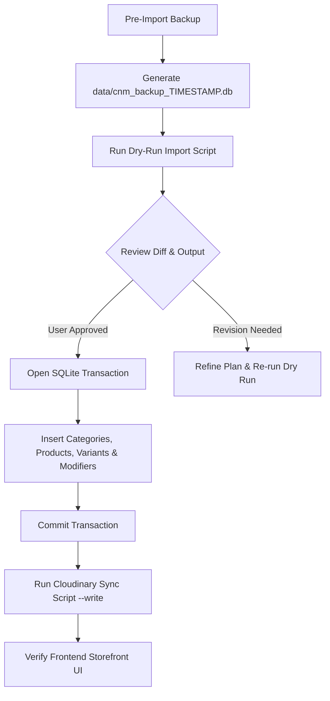

# Cluck N Moo (CNM) Real Menu Database Import Plan

> **Document Status**: Proposal & Architecture Plan (Zero Code or Database Changes Executed)  
> **Source of Truth**: Official Extracted CNM Menu (`docs/VERIFIED_CNM_MENU_EXTRACTION.md`)  
> **Target Database**: SQLite `data/cnm.db` (Governed by Better-SQLite3)  
> **Safety Rule**: Dry-run preview and manual user approval required before any execution.

---

## 1. Starter / Demo Records Audit (To be Replaced / Archived)

The database currently contains 16 initial seed starter records. Under this plan, these placeholder records will be systematically archived or replaced by the real extracted items:

| Current DB ID | Current Name in DB | Status / Action | Replacement / Destination in Real Menu |
| :--- | :--- | :--- | :--- |
| `prod_classic_smash` | The Classic Smash Burger | **REPLACE** | `classic-cheeseburger` (Single: 620, Double: 800 PKR) |
| `prod_cluck_zinger` | Crispy Cluck Zinger | **REPLACE** | `original-xinger-burger` (450 PKR) |
| `prod_moo_cluck_duo` | Moo & Cluck Duo Monster | **REPLACE** | `cluckin-mootastic-deal` (Box Deal, 3350 PKR) |
| `prod_golden_chicken_3` | Golden Fried Chicken (3 Pcs) | **REPLACE** | `fried-chicken` (Variants: 1 Pc 210, 3 Pcs 570 PKR) |
| `prod_crispy_tenders` | Crispy Chicken Tenders (4 Pcs) | **REPLACE** | `chicken-strips` (4 Pcs, 550 PKR with rub options) |
| `prod_chicken_tikka_pizza`| Chicken Tikka Supreme Pizza | **REPLACE** | `flaming-tikka-pizza` (Small 550, Med 1150, Lrg 1650) |
| `prod_fajita_sicilian_pizza`| Chicken Fajita Sicilian Pizza | **ARCHIVE** | Not present on official menu board |
| `prod_cheese_lover_pizza` | Cheesy Four-Cheese Lover | **ARCHIVE** | Replaced by `hot-pepperoni-pizza`, `secret-cnm-pizza`, etc. |
| `deal_solo_box` | CNM Solo Box Deal | **REPLACE** | `chicken-box-deal` (Box Deals, 890 PKR) |
| `deal_duo_smash` | Duo Smash Feast | **REPLACE** | `combo-deal-1` (Deal 1, Chick 1600 / Beef 1900 PKR) |
| `deal_town_family` | Juiciest in Town Family Feast | **REPLACE** | `combo-deal-3` / `cnm-fiesta-deal` (3450 PKR) |
| `side_salted_fries` | Classic Golden Fries | **REPLACE** | `regular-fries-with-dip` (200 PKR with Plain/Masala) |
| `side_cheddar_fries` | Melted Cheese Loaded Fries | **REPLACE** | `chicken-cheese-loaded-fries` (650 PKR) |
| `side_garlic_dip` | Signature Garlic Mayo Dip | **REPLACE** | Add-on Dips modifier group (90 PKR) |
| `drink_soft_can` | Chilled Soft Drink (345ml) | **REPLACE** | `soda-woda` (Regular: 110, Large: 230 PKR) |
| `drink_mineral_water` | Mineral Water (500ml) | **REPLACE** | `still-water` (Regular: 80, Large: 140 PKR) |

---

## 2. Proposed Real Categories Structure

To accurately reflect CNM's official menu sections and signature branding:

| Category ID | Category Name | Description | Display Order |
| :--- | :--- | :--- | :--- |
| `cat_beef_burgers` | **Beef Burgers with Cheese** | 100% Pure Beef smashed & thick patties | 1 |
| `cat_chicken_burgers`| **Chicken Burgers with Cheese** | "cluck yeah!" crispy & grilled chicken burgers | 2 |
| `cat_appetizers` | **Appetizers & Fried Chicken** | Onion rings, mozzarella sticks, tenders, wings, fried chicken | 3 |
| `cat_fries_more` | **Fries N More** | Plain/masala fries, curly fries, loaded fries | 4 |
| `cat_wraps` | **Crunchwraps & Tortilla Wraps**| Creamy Kruncher, Flame Fold, Crispy/Grilled wraps | 5 |
| `cat_sandwiches` | **Sandwiches** | Artisanal sandwiches served with crispy fries | 6 |
| `cat_pizzas` | **Artisan Round Pizzas** | Hand-tossed round pizzas with signature flavours | 7 |
| `cat_pizza_specials` | **Signature Pizza Specials** | Tray Pizza and Stuffed Calzones | 8 |
| `cat_pasta_sides` | **Pastas & Oven Sides** | Baked creamy pasta, Italian pasta, pizza fries, spin rolls | 9 |
| `cat_box_deals` | **Box Deals** | Value boxes: Big Bird Duo, Bull-Dozed, Cluckin' Mootastic, etc. | 10 |
| `cat_combo_deals` | **Numbered Combo Deals** | Deals 1 to 5 & Party Deal | 11 |
| `cat_student_deals` | **Student Offers** | Valid 11 AM - 5 PM special discounted bundles | 12 |
| `cat_desserts` | **Desserts** | Choco French Toast, Churros Locos, Cookie Skillet | 13 |
| `cat_drinks` | **Drinks & Chillers** | Still water, Soda Woda, Lemon Mint, Peach Tea, Coffee, Shakes | 14 |

---

## 3. Proposed Product Catalog & Variants

### 3.1. Beef Burgers with Cheese
- **Oklahoma Smash** (`oklahoma-smash-burger`):
  - Variants: Single (670 PKR), Double (890 PKR)
- **Classic Cheeseburger** (`classic-cheeseburger`):
  - Variants: Single (620 PKR), Double (800 PKR)
- **The OG** (`the-og-burger`): Base 730 PKR
- **Philly CheeseSteak** (`philly-cheesesteak`): Base 750 PKR
- **Mushroom n Swiss** (`mushroom-n-swiss-burger`): Base 740 PKR

### 3.2. Chicken Burgers with Cheese
- **Original Xinger** (`original-xinger-burger`): Base 450 PKR
- **Nashville Hot** (`nashville-hot-burger`): Base 590 PKR
- **Citrus Honey Crunch** (`citrus-honey-crunch-burger`): Base 590 PKR
- **Smashin' Cluck** (`smashin-cluck-burger`): Base 490 PKR
- **Smoky BBQ** (`smoky-bbq-burger`): Base 570 PKR
- **Clucky Patty** (`clucky-patty-burger`): Base 420 PKR

### 3.3. Appetizers
- **Onion Rings** (`onion-rings`): 340 PKR (8 Pcs)
- **Mozzarella Sticks** (`mozzarella-sticks`): 590 PKR (4 Pcs)
- **Fish N Chips** (`fish-n-chips`): 1400 PKR (4 Strips + Fries)
- **Nuggets N Fries** (`nuggets-n-fries`): 490 PKR (6 Pcs + Fries)
- **Chicken Strips** (`chicken-strips`): 550 PKR (4 Pcs) + Flavor rub modifier
- **Chicken Wings** (`chicken-wings`): 550 PKR (8 Pcs) + Flavor rub modifier
- **Fried Chicken** (`fried-chicken`):
  - Variants: 1 Pc (210 PKR), 3 Pcs (570 PKR) + Flavor rub modifier

### 3.4. Fries N More
- **Regular Fries with Dip** (`regular-fries-with-dip`): 200 PKR (Variants: Plain / Masala)
- **Large Fries with Dip** (`large-fries-with-dip`): 350 PKR (Variants: Plain / Masala)
- **Curly Fries with Dip** (`curly-fries-with-dip`): 470 PKR
- **Beef Cheese Loaded Fries** (`beef-cheese-loaded-fries`): 690 PKR
- **Chicken Cheese Loaded Fries** (`chicken-cheese-loaded-fries`): 650 PKR

### 3.5. Wraps
- **Creamy Kruncher** (`creamy-kruncher`): 550 PKR
- **Flame Fold** (`flame-fold`): 550 PKR
- **Crispy Chicken Wrap** (`crispy-chicken-wrap`): 560 PKR
- **Grilled Chicken Wrap** (`grilled-chicken-wrap`): 650 PKR

### 3.6. Sandwiches (with Fries) & Specialties
- **Cheese Toast** (`cheese-toast`): 330 PKR
- **Mujhe Anday Wala Burger** (`mujhe-anday-wala-burger`): 490 PKR
- **Smashed Beef Sandwich** (`smashed-beef-sandwich`): 740 PKR
- **Crispy Chicken Sandwich** (`crispy-chicken-sandwich`): 640 PKR
- **Grilled Chicken Sandwich** (`grilled-chicken-sandwich`): 670 PKR
- **Fish O Fillet** (`fish-o-fillet`): 850 PKR
- **Pasta La Vista** (`pasta-la-vista`): 630 PKR

### 3.7. Round Artisan Pizzas
All 5 flavors (`flaming-tikka-pizza`, `behari-kebab-pizza`, `hot-pepperoni-pizza`, `creamy-alfredo-pizza`, `secret-cnm-pizza`):
- Variants:
  - Small (7"): 550 PKR
  - Medium (10"): 1150 PKR
  - Large (13"): 1650 PKR

### 3.8. Pizza Specials & Pastas
- **Tray Pizza** (`tray-pizza`): 2100 PKR (Two flavor modifier selections)
- **Stuffed Calzone** (`stuffed-calzone`): 950 PKR (Flavor choice: Flaming Tikka / Creamy Alfredo)
- **Spin Rolls** (`spin-rolls`): Variants: 3 Pcs (420 PKR), 6 Pcs (720 PKR)
- **Cheesy Garlic Bread** (`cheesy-garlic-bread`): 350 PKR
- **Baked Creamy Pasta** (`baked-creamy-pasta`): 690 PKR
- **Italian Pasta** (`italian-pasta`): 690 PKR
- **Pizza Fries** (`pizza-fries`): 690 PKR
- **Oven Baked Wings** (`oven-baked-wings`): Variants: 6 Pcs (400 PKR), 12 Pcs (750 PKR)

### 3.9. Deals
- **Numbered Deals**:
  - Deal 1: Chick 1600 PKR, Beef 1900 PKR
  - Deal 2: Chick 2450 PKR, Beef 2800 PKR
  - Deal 3: Chick 3600 PKR, Beef 4200 PKR
  - Deal 4: 700 PKR
  - Deal 5: Small 1050 PKR, Medium 1850 PKR, Large 2850 PKR
  - Party Deal: 9999 PKR
- **Student Deals (11 AM - 5 PM)**:
  - Student Deal 1: 950 PKR
  - Student Deal 2: 870 PKR
  - Student Deal 3: 799 PKR
- **Box Deals**:
  - Big Bird Duo (1550 PKR), Bull-Dozed (1920 PKR), Too Hot To Handle (1580 PKR), Wrap It Up (1380 PKR), Triple Threat (2290 PKR), Chicken Box (890 PKR), CNM Fiesta (3450 PKR), Quad Chick Feast (2480 PKR), Cluckin' Mootastic (3350 PKR).

### 3.10. Desserts & Drinks
- **Desserts**:
  - Choco French Toast (550 PKR), Churros Locos (350 PKR), Cookie Skillet (450 PKR).
- **Drinks**:
  - Still Water (Reg 80 / Lrg 140 PKR), Soda Woda (Reg 110 / Lrg 230 PKR), Lemon Mint Refresher (250 PKR), Peach Iced Tea (250 PKR), Cold Coffee (450 PKR), Milk Shakes (Vanilla/Oreo 540 PKR, Lotus/Chocotella 740 PKR).

---

## 4. Proposed Modifier Groups

1. **Make It A Meal** (Attached to all Burgers & Sandwiches):
   - `Fries N Drink` (+280 PKR)
   - `Fries N Chiller` (+390 PKR)
   - `Fries N Shake` (+650 PKR)
   - `Upgrade to Curly Fries` (+150 PKR)
2. **Burger Extras / Add-Ons**:
   - `Extra Chicken Patty` (+200 PKR)
   - `Extra Beef Patty` (+250 PKR)
   - `Cheese Slice` (+90 PKR)
   - `Caramelised Onions` (+50 PKR)
   - `Pickles` (+50 PKR)
   - `Mushrooms` (+70 PKR)
3. **Dip Selection (90 PKR each)**:
   - Garlic Mayo, Zipotle, Ranch, CNM, Smoky BBQ
4. **Chicken Flavor Rub** (Required 1 selection, free):
   - Original, Hot, Lem n Herb, Honey BBQ
5. **Pizza Stuffed Crust**:
   - Cheese Stuffed Crust (+250 Med / +350 Lrg)
   - Kebab Stuffed Crust (+250 Med / +350 Lrg)

---

## 5. Execution & Safety Protocol



### 5.1. Database Backup Strategy
Before touching the database, the import script automatically creates an isolated, exact copy of the database:
```bash
data/backups/cnm_pre_menu_import_YYYYMMDD_HHMMSS.db
```

### 5.2. SQLite Transaction Strategy
All database modifications are wrapped in an atomic transaction:
```typescript
const transaction = db.transaction(() => {
  // Archive old starter records
  // Insert new verified categories
  // Insert new verified products
  // Insert variants and modifiers
});
try {
  transaction();
} catch (error) {
  // SQLite automatically rolls back all changes
  console.error("Transaction failed, database untouched:", error);
}
```

### 5.3. Safe Rollback Strategy
If any anomaly or discrepancy is identified post-import:
1. Stop the application server.
2. Restore the backup file:
   `copy data/backups/cnm_pre_menu_import_*.db data/cnm.db`
3. Restart dev server.

### 5.4. Cloudinary Post-Import Synchronization
Once the real products are committed into the database, running `npm run cloudinary:sync` will immediately bind the 64 matched Cloudinary image URLs directly to each real product record.
